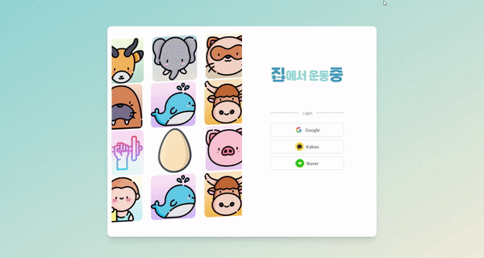
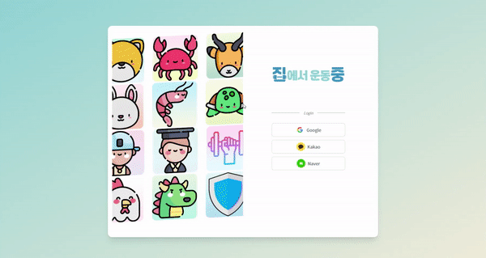
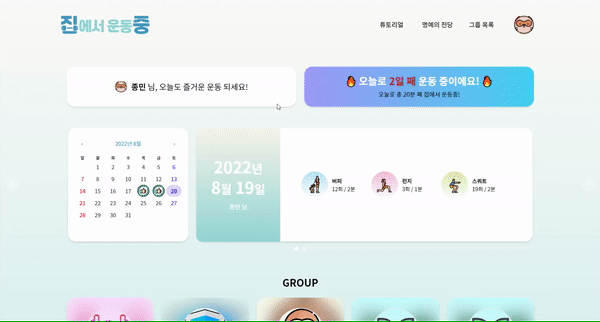
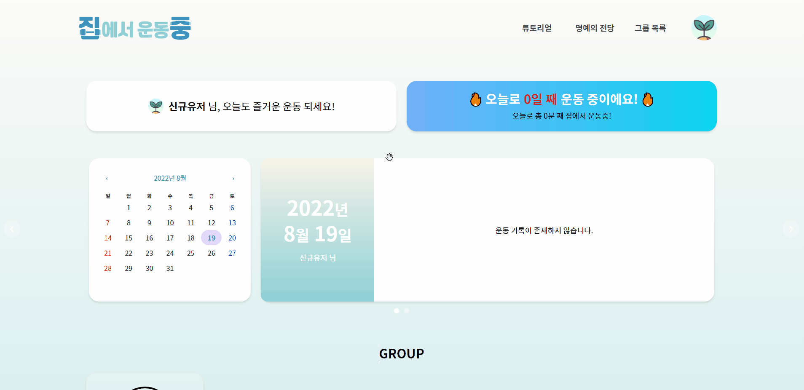
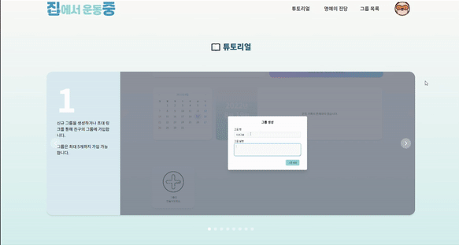
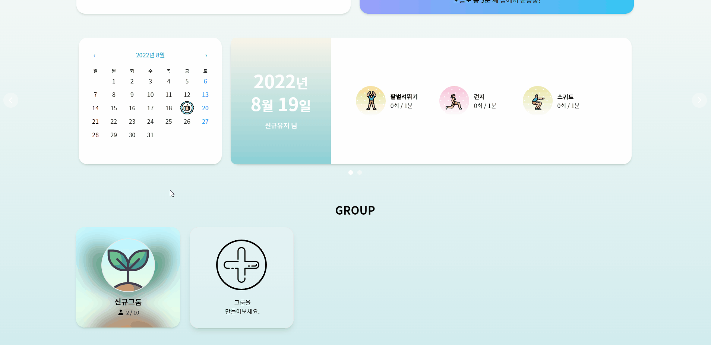
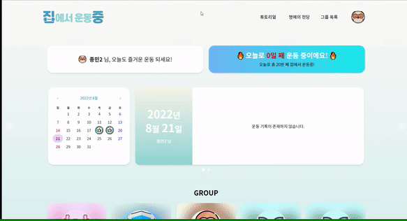
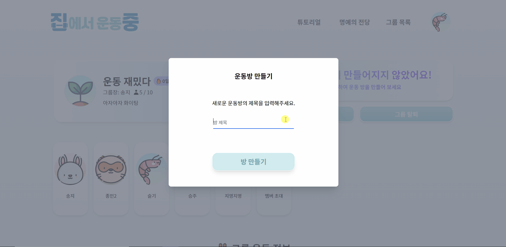

# 🖥️ **서비스 화면**

각 화면 동작을 보여주는 gif 이미지가 첨부되어 있습니다. 이미지가 로딩되기 까지 시간이 소요됩니다.

### **회원가입 절차 ( 소셜로그인 )**

- 닉네임 입력 - 닉네임 중복 조회

    
  
  
- 전에 로그인 했던 사용자는 즉시 메인 페이지로 이동

  

### 마이페이지

- 달력을 통한 개인 운동 기록 및 가입한 그룹 목록 등 운동 기록을 볼 수 있음

  

- 그룹 생성
  

### 개인 정보 수정

- Navbar에서 개인 정보 수정 및 닉네임 중복 검사
  

### 튜토리얼

- 서비스를 이용할 수 있도록 기능을 소개해주는 튜토리얼을 Navbar에 표시
  

### 그룹 페이지

- 그룹페이지에서 그룹에 속한 팀원들의 정보를 볼 수 있음

  

- 날짜별 운동 정보, 쉴드 개수, 그룹 랭킹(본인 그룹 & [위, 아래] 각 2 그룹, 전체 운동 횟수 보기

  

- 운동 방 생성
  

### 그룹 설정 페이지

- 그룹 설정페이지에서 그룹 아이콘 정보 변경 및 획득 이유 열람 가능(그룹장만 열람 가능)
  - 엄지 척 아이콘은 그룹원들이 모두 운동을 한 날
  - 쉴드 아이콘은 그룹이 쉴드를 가진 상태에서 운동을 다하지 못한 상태에서 다음날에 아이템이 자동으로 써집니다
    

### 루틴 페이지

- 그룹페이지에서 루틴을 설정 가능(6가지 운동 및 휴식)
  

### 운동 페이지

- 운동방 생성 및 루틴 선택
  - 운동방이 생성되면 등록된 루틴 확인 및 선택 가능
    
- 운동 진행 화면

  - 타이머: 남은 운동 시간 표시
  - 운동 리스트: 운동 루틴의 진행 상황 안내
  - 현재 운동: 현재 진행되고 있는 운동, 목표 횟수, 달성 횟수 정보 제공

  

- 운동 종료 후 결과 페이지 확인
  

### 명예의 전당

- [그룹, 개인] 랭킹 확인
  - 타임 랭킹 - 운동 시간 순 / 스트릭 랭킹 - 연속한 일 수 순
    
